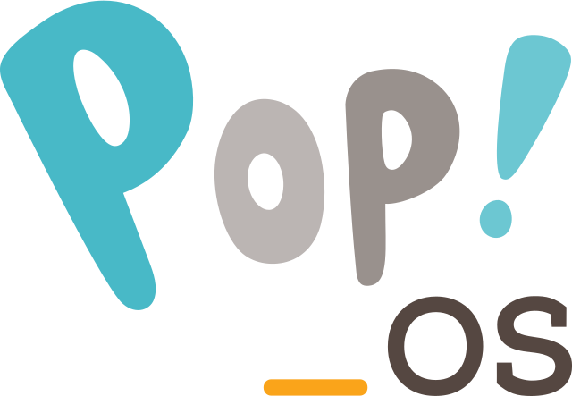

### Hi there 

I'm umgbhalla.

- 🔭 I’m currently working on Web frontend/backend programs.
- 🌱 Learning information technology at IIIT BHOPAL
- 💬 Ask me about anything!
- 😄 Pronouns: [he/him/his](https://pronoun.is/he)
- 📫 How to reach me: [e-mail](mailto:umg.bhalla88@gmail.com) / [Telegram](https://t.me/umgbhalla) / [Twitter](https://twitter.com/umgbhalla)
- ⚡ Fun fact: I dont have a life.
 

<!--  -->

  
⚙️ <b><i>Languages and Tools</i></b>

<code></code>
<code></code>
<code></code>
<code></code>
<code></code>
<code></code>
<code></code>
<!-- <code></code> -->

  
📊 <b><i>GitHub Stats</i></b>

<a href="https://github.com/anuraghazra/github-readme-stats">

<!--    -->
</a>

  
🐧 <b><i>EndeavourOS</i></b>

  

<!--    -->

<!-- 

  
🐧 <b><i>Pop!_OS</i></b>

  

 -->

