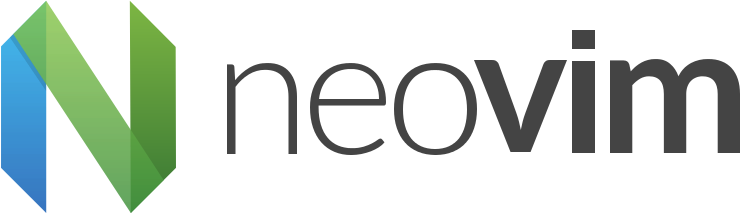
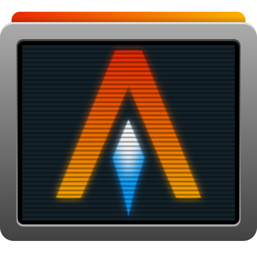

<!-- 

 -->
<h2 align="center"> ━━━━━━  ❖  ━━━━━━ </h2> 

<code></code>
<code></code>
<code></code>
<code></code>
<code></code>
<code></code>
<code></code>

<!-- 

  
⚙️ <b><i>Languages and Tools</i></b>

<code></code>
<code></code>
<code></code>
<code></code>
<code></code>
<code></code>
<code></code>

 -->

<!-- 

  
📊 <b><i>GitHub Stats</i></b>

 -->

<!-- 

 -->
 
 
 

🐧 <b><i>EndeavourOS rice</i></b>

  

