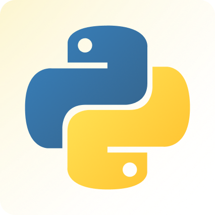
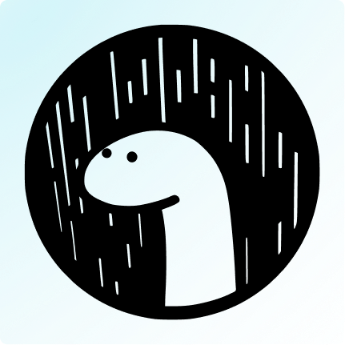

<!-- 

 -->
<h5>Socials </h5>

<!--  -->
<!--  -->
<!--  -->
<h2>  Proficient </h2>

 

<h2> Learning  </h2>

<!--  -->

<!--  -->
<!--  -->

<h2>  Tools </h2>

  
more info

<!--  -->

<!--  -->
   

<!-- 

 -->
   <a href="https://github.com/umgbhalla/dotstow">
      <h3>Current Rice</h3>

</a>

  
 
 

 
