 

<!-- <h4> > whoami </h4>  -->

<samp>
MLops/Devops Engineer 
<a href="https://x.com/umgbhalla/">𝕏</a>  
<a href="https://umgbhalla.xyz">xyz</a>  
</samp>

  

 
<kbd>more info</kbd>

 

  <a href="https://github.com/umgbhalla">

</a>
<a href="https://github.com/umgbhalla/dotstow">
      <h2>old rice</h2>

</a>
 

<!--  

 
<kbd>more info</kbd>

<!--  -->

<!--  -->
   

<!-- 

 -->
 

<!-- 
 -->
<!--   
  -->
<!--  
  -->
 
<!--     -->
<!-- <h5>Socials </h5> -->
<!-- 

 -->
<!--  -->
<!--  -->
<!--  -->
<!-- 
 -->
