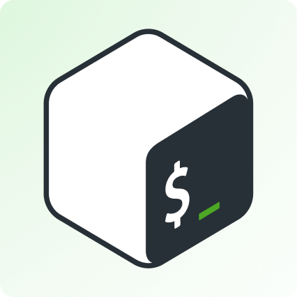

<!-- 

 -->

   
Socials
  

   
Strengths
  

   
Learning
  

<!--  -->

  
Tools

  
Stats and more info

<!--  -->

<!--  -->
   

<!-- 

 -->
   <a href="https://github.com/umgbhalla/dotstow">

</a>

  
 
 

